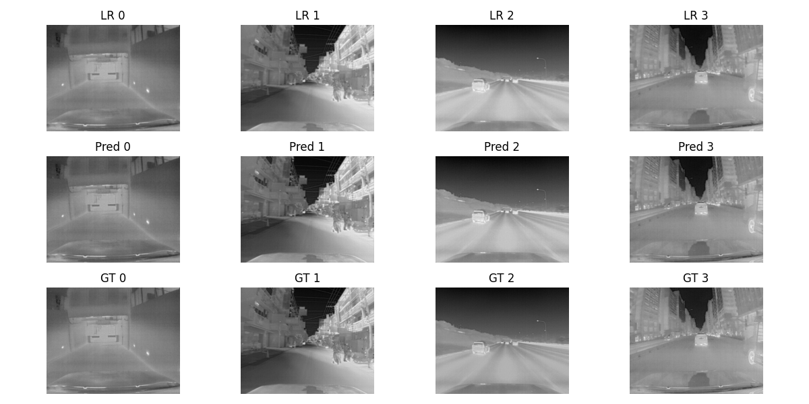

# TEN: Thermal Image Enhancement using CNN

這個專案實作了[Thermal Image Enhancement using Convolutional Neural Network](https://ieeexplore.ieee.org/document/7759059)論文來提升低解析度熱影像品質的方法，旨在改善熱影像在物體偵測、導航等任務中的應用表現。專案支援兩種資料集模式：

- **Patch 模式**：從每張影像中隨機裁剪固定大小的 patch 進行訓練，適合資料量大、計算資源有限的情況。
- **Full 模式**：直接使用整張影像進行訓練，並可選擇對影像進行 resize 處理。

由於網路架構採用全卷積設計與適當的 padding，模型可以在訓練時用小 patch 學習局部特徵，而在推論時直接對任意尺寸的影像進行增強。

---

## 目錄

- [特點](#特點)
- [依賴套件](#依賴套件)
- [安裝](#安裝)
- [使用說明](#使用說明)
  - [訓練](#訓練)
  - [參數說明](#參數說明)
- [輸出結果](#輸出結果)
- [其他](#其他)

---

## 特點

- **靈活的資料集模式**：可選擇使用隨機裁剪 patch 或直接使用整張影像進行訓練。
- **可配置超參數**：透過命令列參數可設定 patch_size、scale、batch_size、num_epochs、初始學習率等。
- **多 GPU 支援與預訓練權重載入**：可指定 GPU 裝置並載入預先訓練的模型權重。
- **自動生成實驗資料夾**：根據 output 資料夾中的 exp 資料夾自動生成新的實驗資料夾，存放 checkpoint 與訓練 log。
- **Epoch 時間與 Loss Log 記錄**：每個 epoch 完成後紀錄訓練與驗證 loss 及耗時，便於追蹤模型訓練進度。
- **Sample 結果輸出**：每個 epoch 結束後從驗證集隨機抽取 sample，並將原始低解析度影像、模型輸出與 ground truth 做成比較圖輸出。

---

## 依賴套件

本專案主要使用以下 Python 套件：

- Python 3.x
- [PyTorch](https://pytorch.org/)
- torchvision
- matplotlib
- argparse
-Pillow

---

## 安裝

1. **建立虛擬環境（可選）：**

   ```bash
   python -m venv venv
   source venv/bin/activate  # Linux / macOS
   venv\Scripts\activate     # Windows
   ```
 
2. **安裝依賴的套件：**
  ```bash
  pip install -r requirements.txt
  ```

## 使用說明
本專案提供一個 train.py 作為主要訓練程式。你可以透過命令列參數來靈活設定各項超參數、資料集模式、GPU 裝置以及預訓練權重等。

### 訓練
範例 1： **使用 patch 模式進行訓練**
  ```bash
  python train.py \
    --dataset_type patch \
    --train_dir /path/to/train \
    --val_dir /path/to/val \
    --patch_size 64 \
    --scale 2 \
    --batch_size 512 \
    --num_epochs 1000 \
    --initial_lr 0.001 \
    --device cuda:0 \
    --output_root ./output
  ```
範例 2：**使用 full 模式（整張影像），並指定影像尺寸為 320x240**
  ```bash
  python train.py \
    --dataset_type full \
    --train_dir /path/to/train \
    --val_dir /path/to/val \
    --resize 320,240 \
    --scale 2 \
    --batch_size 512 \
    --num_epochs 1000 \
    --initial_lr 0.001 \
    --device cuda \
    --output_root ./output
  ```
若有預訓練權重，則可加入 `--pretrain /path/to/pretrained_weights.pth`。

### 參數說明

- **`--dataset_type`**：選擇資料集模式  
  - `patch`：使用隨機裁剪 patch 的 `ThermalDataset`  
  - `full`：使用整張影像的 `FullImageThermalDataset`  

- **`--train_dir`** 與 **`--val_dir`**：指定訓練與驗證資料夾的路徑。

- **`--resize`**：僅在 `full` 模式下使用，格式必須為 `width,height`（例如 `320,240`）。

- **`--patch_size`**：僅在 `patch` 模式下有效，指定每個 patch 的尺寸，預設為 `64`。

- **`--scale`**：放大倍率，預設為 `2`（可設為 `3`）。

- **`--batch_size`**：batch size，預設為 `1024`，請根據 GPU 記憶體調整。

- **`--num_epochs`**：訓練的 epoch 數，預設為 `1700`。

- **`--initial_lr`**：初始學習率，預設為 `0.001`。

- **`--device`**：指定訓練裝置，例如 `cuda:0` 或 `cpu`。

- **`--pretrain`**：預訓練權重檔案路徑，如有提供則會載入該權重。

- **`--output_root`**：存放 checkpoint 與 log 的根目錄，程式會自動建立 `exp` 資料夾（例如 `exp0`, `exp1` 等）。
- 
## 輸出結果
程式會在 `--output_root` 指定的資料夾中自動生成新的 `exp` 資料夾（例如 `./output/exp2`），其中包含：
- **最佳模型權重檔案**：`ten_best.pth`
- **Loss 記錄檔**：`loss_log.txt`（記錄每個 epoch 的 `train loss`、`val loss` 與 `耗時`）

### Sample 結果圖

每個 epoch 結束後，程式會從驗證資料集中隨機抽取 **4 個 sample**，並在 `./sample` 資料夾中儲存 **比較圖**，比較內容包括：
- **低解析度輸入（LR）**
- **模型預測結果（Pred）**
- **Ground Truth（GT）**
## 其他
- **請根據實際 GPU 資源調整 `batch_size` 與 `num_workers`。**
